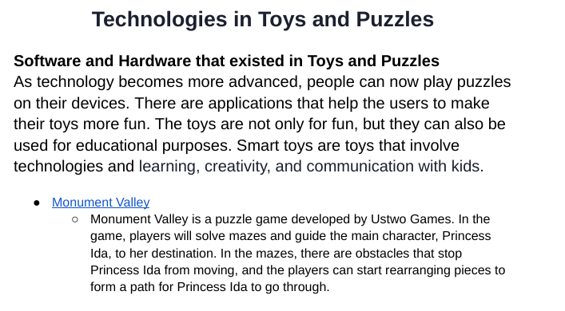

# Entry 6
##### 5/5/24

## Toys and Puzzles Website
After 9 months of searching for information and learning HTML, CSS, and Bootstrap, I have made a website about **Toys and Puzzles**. 

### Steps before coding 

#### Planing 
Before I can do anything else, I need to plan it first. I need to make two wireframes, one computer and one mobile. The website that we used to make our wireframes is [Wireframe.cc](https://wireframe.cc). My partner, Ellen, worked on the mobile wireframe, and I worked on the computer wireframe. Here are our wireframes:
- [Mobile](https://wireframe.cc/FoHNt8)
- [Computer](https://wireframe.cc/ziMqQp) 

The second thing we did after we finished our wireframes was to plan out the days that we would work on our project. We assigned specific parts that we needed to do on specific days, so we could work through out the break. 

```
* Task/Timeline

- 4/12/24 Friday - Plan
- 4/15+4/16 Monday + Tuesday - Finish/orgainzed content 
- 4/17/24 Wednesday - Find picture/research = navbar, homepage
- 4/18+4/19 Thursday + Friday - Present software
- 4/20+4/21 Saturday + Sunday - Present Hardware 
- 4/22+4/23 Monday + Tuesday - Present both 
- 4/24 - 4/27 Wednesday - Saturday - Future ideas 
- 4/28 Sunday - Aframe 
- 4/29 Monday - Add colors, fonts 
- 4/30 Tuesday - Check for requirements/relax 
```

#### Organize the content 
The first thing that I put on was to organize our content. We turned our research into paragraphs, so they look more organized. At first, they were just bullet points, but I made them into sentences and added more details. 



### Coding 
We decide to use a Bootstrap template for our project. I found a free template on [Start Boostrap](https://startbootstrap.com/) and downloaded it to my computer and unzipped it in my IDE. The [template](https://startbootstrap.com/theme/agency) was originally made for a portfolio, so it has sections that we don't need for our project. I deleted the images they provided and the sections that we are not going to use.

For example, the original navbar has five sections, such as Services, Portfolio, About, Team, and Contact. I deleted the Team and Contact part and changed the name for the rest of the sections. 

``` HTML
<div class="collapse navbar-collapse" id="navbarResponsive">
    <ul class="navbar-nav text-uppercase ms-auto py-4 py-lg-0">
        <li class="nav-item"><a class="nav-link" href="#context">Context</a></li>
        <li class="nav-item"><a class="nav-link" href="#present">Present</a></li>
        <li class="nav-item"><a class="nav-link" href="#future">Future</a></li>
    </ul>
</div>
```

Later, we have to find new images and replace the placeholder text with our content. We also need to use our tool in our project. The tool that Ellen had was Aframe and mine was SASS. 


When we start working, we split up the work. I went to find images for the present technologies and uploaded them to GitHub, and Ellen drew the images for future technologies and linked these images to the website. When she was working on her Aframe, I was putting our content into the website. We worked together and finished the minimum valuable product of our project before the deadline. 

### Challenge 1  
The challenge that we faced when making our website was the images. The sizes of the images that I found on the internet were all different. I have tried to use CSS to change the size of these images, but they looked very ugly when I did that. Some of the images would get squeezed while others were perfect. So, Ellen and I went to find new images to place the old ones, and this time we selected images that have similar sizes. 

### Challenge 2
The second challenge that we faced was our tools. For Ellen, she has to use Aframe to make a model of our future technologies. One of the technologies that we have is "A toy that can make music based on the user’s feeling." For this toy, Ellen needs to make models for a bracelet and a speaker. She was struggling to make the bracelet, so we asked our other friends who also learned Aframe. One of our friends Xue helped us by giving us an idea of what code she could use. 

The challenge that I had on my tool was when I was compiling my SASS code to the CSS file that the template has, the code that I wrote override the code that the template has. This triggered me because I only wanted to change some parts of the code and not all of them. When I went back to school and told my teacher about that, he said I could first copy all the CSS code to my SASS file and then write my code. 

### Takeaway
One takeaway that I have was to decide whether we are going to use a template or not before we make our wireframes. Our project did not look like our wireframes because I had not decided whether to use a template or not when making our wireframe, so it came out that they did not match. Next time, I will consider that before I make the wireframes. 

### Engineering Design Process
Now, I am currently on step 5 **Create a prototype**, and step 6 **Test and evaluate the prototype**. I have made a simple website that has all the information needed but it is not perfect. For the next stage, which is step 7 **Improve as needed**, I  need to add things and test things out to make it look more perfect. 

### Skills 

#### Collaboration
One skill that I learned was **Collaboration**. In this project, I split up the work with my partner, so each of us worked on different parts of the project. We also helped each other out when one of us had problems. For example, at first, it was Ellen finding the images, but she did not know how to upload them onto Github, so I took her part and taught her how to upload images later on when we needed to find new images. 

#### Communication
The second skill that I learned was **Communication**. During the break, we used Discord to communicate and call when we were doing the project. When she was making the model for future technology, I told her what how the bracelet should look like. 


[Previous](entry05.md) | [Next](entry07.md)

[Home](../README.md)